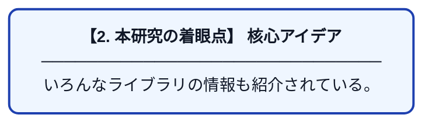

# 差分プライバシーによるデータ活用最前線

> **💡 一言要約**: いろんなライブラリの情報も紹介されている。

| 項目 | 内容 |
|---|---|
| **PDF版要約** | [README.pdf](./README.pdf) |

---

## 📊 新規性の図解（先行研究との違いと本研究のブレークスルー）

```mermaid
%%{init: {'flowchart': {'wrappingWidth': 520, 'nodeSpacing': 18, 'rankSpacing': 28, 'padding': 14, 'curve': 'basis'}, 'themeVariables': {'fontSize': '14px'}}}%%
flowchart TD
    S1["<b>【2. 本研究の着眼点】 核心アイデア</b><br/>──────────────────────────────<br/>いろんなライブラリの情報も紹介されている。"]
    style S1 fill:#EFF6FF,stroke:#1E40AF,stroke-width:2px,color:#111827,rx:8,ry:8
```
